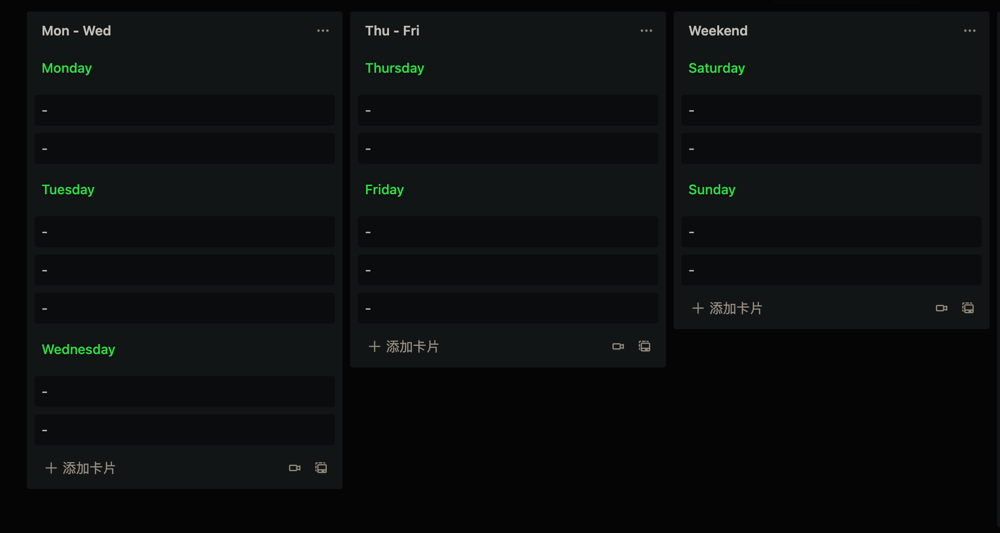
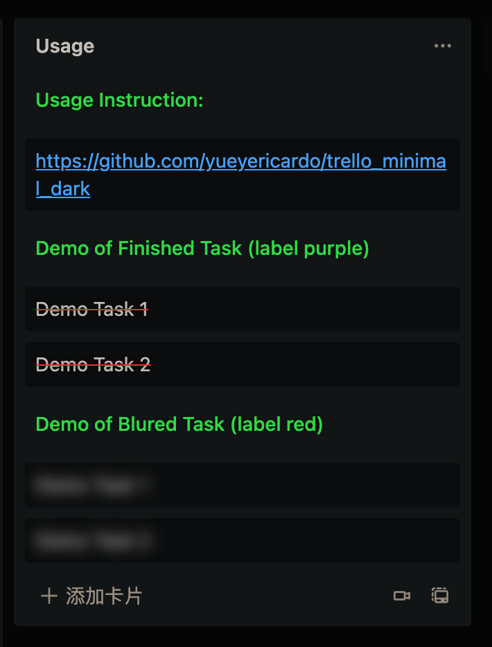

 <h1 align="center">Trello Minimal Dark</h1>

  Make Trello like <a href="https://nullboard.io/preview" rel="nofollow" class="rich-diff-level-one">nullboard</a>
   
  <a href="https://greasyfork.org/en/scripts/426680-trello-minimal-dark" rel="nofollow" class="rich-diff-level-one">install</a>
   · 
  <a href="https://trello.com/b/FMKNGeBx/week-template" rel="nofollow" class="rich-diff-level-one">week template</a>
   
  <a href="https://trello.com/b/FMKNGeBx/week-template" rel="nofollow" class="rich-diff-level-one">English</a>
  · 
  <a href="https://trello.com/b/FMKNGeBx/week-template" rel="nofollow" class="rich-diff-level-one">简体中文</a>

### Usage
1. Section Title
2. Mark a card as finished
3. Blur a card

### 使用方法
1. 标题
2. 划线一个任务
3. 模糊一个任务