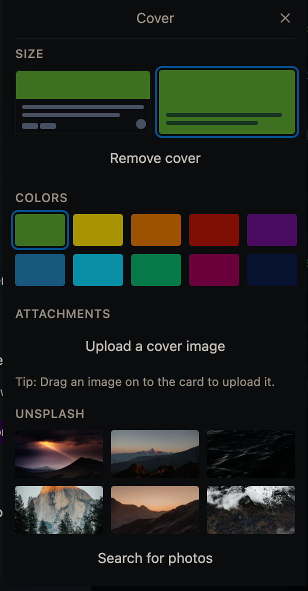

 <h1 align="center">Trello Minimal Dark</h1>

  Make Trello like <a href="https://nullboard.io/preview" rel="nofollow" class="rich-diff-level-one">nullboard</a>
   
  <a href="README.en.md" rel="nofollow" class="rich-diff-level-one">English</a>
  · 
  <a href="README.md" rel="nofollow" class="rich-diff-level-one">简体中文</a>

## Install
1. install Tampermonkey
1. install the script：https://greasyfork.org/en/scripts/426680-trello-minimal-dark
1. Week Template：https://trello.com/b/FMKNGeBx/week-template

### Usage
2. Mark a card as finished: purple label (Shortcut: 5)
3. Blur a card: red label (Shortcut: 4)
4. Section Title: click the card, select cover, then choose size 2

    

