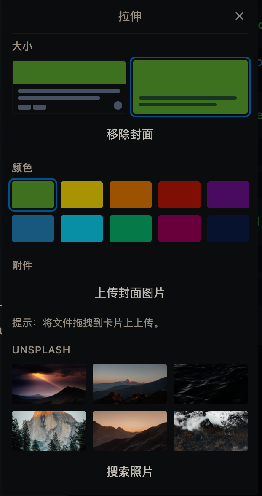

 <h1 align="center">Trello Minimal Dark</h1>

  Make Trello like <a href="https://nullboard.io/preview" rel="nofollow" class="rich-diff-level-one">nullboard</a>
   
  <a href="README.en.md" rel="nofollow" class="rich-diff-level-one">English</a>
  · 
  <a href="README.md" rel="nofollow" class="rich-diff-level-one">简体中文</a>

## 安装
1. 安装 Tampermonkey
1. 安装脚本：https://greasyfork.org/en/scripts/426680-trello-minimal-dark
1. Week Template：https://trello.com/b/FMKNGeBx/week-template

## 使用方法

1. 划线一个任务：紫色标签（快捷键：5）
1. 模糊一个任务：红色标签（快捷键：4）
1. 标题：点击卡片，选择拉伸，大小选择第二种，任意颜色均可

    

