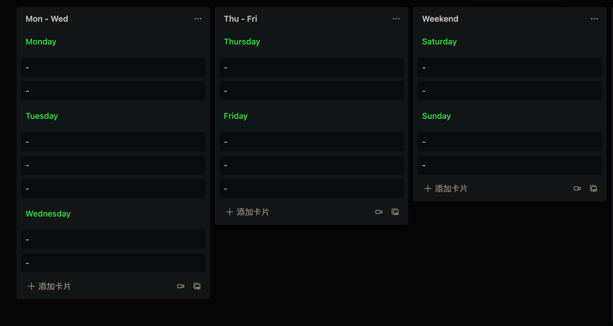
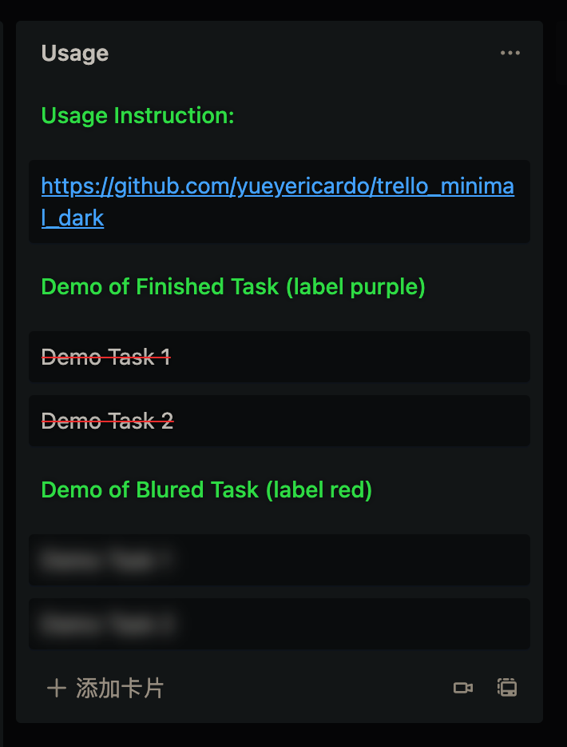

 <h1 align="center">Trello Minimal Dark</h1>

  Make Trello like <a href="https://nullboard.io/preview" rel="nofollow" class="rich-diff-level-one">nullboard</a>
   
  <a href="https://greasyfork.org/en/scripts/426680-trello-minimal-dark" rel="nofollow" class="rich-diff-level-one">install</a>
   · 
  <a href="https://trello.com/b/FMKNGeBx/week-template" rel="nofollow" class="rich-diff-level-one">week template</a>

